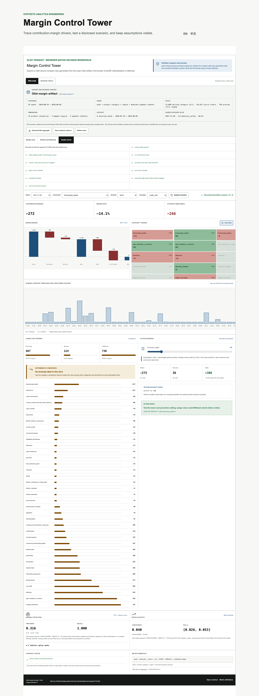

[English](README.md) | [简体中文](README.zh-CN.md)

# Margin Control Tower

[](https://github.com/LucisZhang/margin-control-tower/actions/workflows/ci.yml)

毛利仪表盘通常只向你展示一个 KPI,却隐藏了构成它的所有东西:数据粒度、指标公式、拆分规则、以及推荐行动背后的假设。本项目反其道而行之。它是一个面向每周贡献毛利(contribution margin)的浏览器工作台,其中**数据契约、会计恒等式、异常来源、留出集边界和情景假设都是一等的、可检查的对象**——并且当契约检查失败时,决策输出会被标记为受阻(blocked),而不是被粉饰。

一个托管版本运行在配套的作品集部署上(在本仓库之外;其当前状态无法从此处验证):
https://portfolio-site-nsam734g0-luciszhangs-projects.vercel.app/analytics/margin-control-tower



该截图由 `npm run test:e2e` 重新生成:Playwright 工作流测试(`tests/e2e/workflow.spec.ts`)从运行中的工作台进行整页捕获。

## 本仓库包含什么

这是**受治理的合成数据工作台**:一个固定种子的生成器、已提交的 fixture 产物、类型化契约,以及一个在浏览器中原生计算所有内容的 Next.js 分析界面。

作品集 [`codex/portfolio-phase2`](https://github.com/LucisZhang/portfolio-site/tree/codex/portfolio-phase2) 分支上的一个配套集成在此工作台之上添加了真实数据模式。这些真实数据产物、方法和结果存在于该分支并在那里有文档记录——本仓库中的每一个数字,按设计都是合成 fixture 行为。

## Fixture

种子 `2026071301` 确定性地生成 **9,360 行**,粒度为 周 × 产品 × 地区 × 渠道:52 周、20 个产品、5 个品类、3 个地区、3 个渠道,合计 528,367 笔合成订单。关键结构:

- **最后八周是一个不相交的留出集(holdout)**(7,920 行分析数据 / 1,440 行留出数据),被排除在诊断期间之外,以便情景工作流有一个诚实的边界。
- **在周索引 42 处有一个固定异常**,击中西部地区的电子产品——12 行(4 个产品 × 1 个地区 × 3 个渠道),其订单量、促销深度、退货和履约成本均被抬高。这 12 行在注册表公式下合计为合成总收入 74,346、贡献毛利 −10,331.52。该异常是*被注入并标注的*,因此诊断工作流可以被演示,而无需假装具备检测能力。
- 输出:JSON、CSV、示例 CSV 和 ZSTD Parquet。JSON 封装中嵌入了行数组的 SHA-256 哈希(`rows_sha256`),且每一行都携带 `provenance=synthetic`。

**十项确定性检查**验证必填字段、唯一粒度、非空维度、数值边界、毛收入 → 净收入 → 贡献毛利的会计恒等式、拆分有效性以及来源(provenance)。契约声明的失败策略是失败即关闭(fail-closed):当某项检查失败时,工作台会将决策输出标记为受阻。

## 工作台计算什么

- 一个**七步毛利瀑布**——总收入 → 折扣 → 退货 → 净收入 → COGS → 履约 → 贡献毛利——与每个筛选器联动。
- 52 周趋势、品类 × 地区热力图、成本驱动因素视图和产品贡献者,全部在浏览器中基于已提交的 fixture 计算。
- 一个**带有已披露规则的促销情景**:一个固定的单位响应假设(在 UI 中逐字打印)将促销深度的变化映射为单位销量的变化,同时退货率和单位经济保持不变。UI 将其标注为*假设*,而非预测——这就是情景工具与预测声明之间的区别。
- 留出集提示,将最后八周标记为留出对比,而非诊断证据。

## 快速开始

```bash
npm ci
npm run dev        # http://localhost:3000 — 从已提交的 fixture 确定性启动
```

使用已提交的 fixture,工作台控制栏报告 `10 / 10 contracts pass`。

验证界面:

```bash
npm run generate:data                # 从固定种子重新生成 fixture
npm run generate:analytics-parquet
npm run typecheck
npm run lint
npm run test:e2e                     # next build + Playwright
```

## 声明边界

- 每一行都是合成的;每个指标都是 fixture 行为。被注入的异常和情景演示的是一个决策*工作流*——它们不确立任何真实的提升、检测准确度、预测质量或因果影响。
- 这是一个静态分析案例研究,不是数据仓库、调度器或多服务平台。
- 真实数据工作——其数据集、许可证、方法和结果——属于配套的作品集分支集成及其自有文档记录的代理与局限。其中没有任何内容是由本仓库产生或佐证的。

## 仓库结构图

```text
margin-control-tower/
├── src/app/page.tsx                                 # route entry
├── src/components/analytics/MarginControlTower.tsx  # the margin workbench
├── scripts/generate-analytics-fixtures.mjs          # seeded fixture generator
├── tests/e2e/workflow.spec.ts                       # Playwright workflow test (writes docs/screenshots/)
├── public/case-studies/margin-control-tower/
│   ├── README.md              # metrics and workflow guide
│   ├── architecture.mmd       # system architecture (Mermaid)
│   ├── data-contract.json     # analytical grain + contract
│   └── metric-registry.json   # metric definitions and formulas
└── docs/screenshots/
```

`data-contract.json` / `metric-registry.json` 这对文件是最应该先阅读的部分:粒度和每个指标公式都以数据形式声明,这正是十项检查和瀑布对账得以实现的原因。

## 状态与权利

本仓库是一个作品集案例研究快照,最初构建于 2026-07,没有发布节奏、支持承诺或外部贡献者流程。

尚未授予任何开源许可证;在作出许可证决定之前保留所有权利。已提交的数据集为固定种子合成数据,由所有者生成。